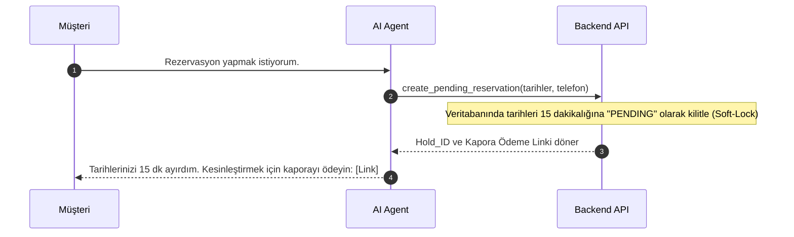
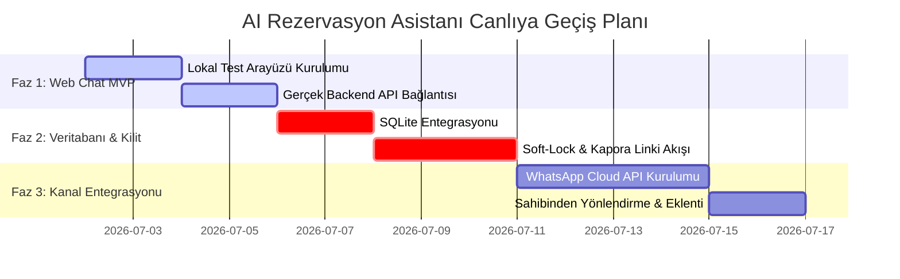

# 🗺️ AI Rezervasyon Asistanı - Özellikler ve Gelecek Yol Haritası

Bu döküman; yapay zeka tabanlı rezervasyon asistanı projesinin mevcut teknik durumunu, mimari kararlarını, gerçek hayat senaryolarındaki olası riskleri ve bu riskleri çözmek için önerilen teknik yol haritasını detaylandırmaktadır.

---

## 📌 1. Mevcut Durum Analizi (Current Status)

Şu anda proje, hızlı test edilebilir ve bağımsız bir **MVP (Minimum Viable Product)** altyapısına sahiptir:

| Bileşen | Durum / Teknoloji | Açıklama |
| :--- | :--- | :--- |
| **Ajan Motoru** | `DeepSeek-V4-Flash / Pro` | OpenAI SDK uyumlu, düşük sıcaklık (`temperature=0.3`) ile tutarlı Tool Calling yeteneği. |
| **Zorunlu Parametreler** | `start_date`, `end_date`, `guest_count` | 3 parametre tamamlanmadan API'ye gitmeyen katı sistem promptu yönetimi. |
| **Hafıza (Memory)** | Bellek İçi (`dict` tabanlı) | Telefon/kullanıcı bazlı konuşma geçmişi tutuluyor fakat geçici (sunucu kapanınca siliniyor). |
| **Simüle Backend** | `mock_backend.py` | 1-15 Ağustos doluluk senaryosu ve alternatif tarih dönme simülasyonu. |
| **Sahibinden Entegrasyonu** | Chrome Extension (Manifest V3) | Tarayıcıda DOM izleme (MutationObserver), yarı otomatik (Copilot) ve tam otomatik oto-gönderim modları. |
| **Test Arayüzü** | CLI + FastAPI Webhook | Terminalden canlı test arayüzü ve API sunucusu. |

---

## ⚡ 2. Kritik Problemler ve Çözüm Önerileri (Challenges & Solutions)

Gerçek dünya entegrasyonunda karşılaşılan teknik engeller ve bunların aşılması için önerilen mimari çözümler:

### A. Eşzamanlılık (Concurrency) & Çift Rezervasyon Riski
> [!WARNING]
> **Risk:** Aynı oda/villa için iki farklı kanaldan (örn. bir WhatsApp, bir Web Chat kullanıcısı) aynı anda sorgu gelirse, sistem ikisine de "Müsait" cevabı dönebilir ve aynı tarihler iki farklı kişiye rezerve edilebilir.

#### 🛠️ Çözüm: Soft-Lock (Geçici Blokaj) Mekanizması
Backend API'sine sadece müsaitlik sorgulayan `check_reservation_status` yerine, rezervasyon niyetini kilitleyen bir endpoint eklenmelidir:



* **Zaman Aşımı (TTL):** 15 dakika içinde ödeme gelmezse, veritabanındaki kilit otomatik olarak kalkar (Redis TTL veya PostgreSQL zamanlanmış görevi ile).

---

### B. Oturum Kalıcılığı (Session Persistence)
> [!IMPORTANT]
> **Risk:** Sunucu her yeniden başladığında (güncellemeler, çökmeler vb.) tüm kullanıcıların konuşma geçmişi sıfırlanmakta ve asistan müşterileri unutmaktadır.

#### 🛠️ Çözüm: SQLite / Redis Veritabanı Entegrasyonu
Hafızayı Python RAM'inde tutmak yerine yerel veya bulut tabanlı bir veritabanına taşımalıyız.

* **SQLite Şeması (`conversations.db`):**
  ```sql
  CREATE TABLE chat_messages (
      id INTEGER PRIMARY KEY AUTOINCREMENT,
      session_id TEXT NOT NULL,          -- WhatsApp No veya Sahibinden Kullanıcı Adı
      role TEXT NOT NULL,                -- 'system', 'user', 'assistant', 'tool'
      content TEXT NOT NULL,             -- Mesaj içeriği veya JSON tool çıktısı
      timestamp DATETIME DEFAULT CURRENT_TIMESTAMP
  );
  ```
* **Nasıl Çalışır?** Her yeni mesaj geldiğinde backend veritabanından o `session_id`'ye ait son 20 mesajı çeker, yeni mesajı listeye ekler, API'ye gönderir ve dönen cevabı veritabanına yazar.

---

### C. Sahibinden.com Entegrasyon Limiti
> [!CAUTION]
> **Teknik Engel:** Sahibinden.com resmi bir gelen mesaj webhook'u sağlamaz ve doğrudan sunucu otomasyonlarını (Selenium vb.) Cloudflare ile engeller.

#### 🛠️ Çözüm: Trafik Yönlendirme (Bypass) & Chrome Extension
* Emlak/Turizm ilan açıklamalarına ekleme yapılır: *"Anlık fiyat, müsaitlik ve hızlı rezervasyon işlemleri için 7/24 aktif WhatsApp hattımızdan yazabilirsiniz: `wa.me/90555xxxxxx`"*
* Bu sayede tüm trafik kontrol edebildiğimiz **WhatsApp** kanalına akar.
* Sahibinden içinde kalmak isteyen inatçı müşteriler için yazdığımız **Chrome Extension (Uzantı)** tarayıcıda açık tutularak yarı otomatik mesajlaşma (Copilot) sağlanır.

---

## 📅 3. Uygulama Yol Haritası (Roadmap)

Projenin canlı rezervasyon almaya başlamasını en hızlı hale getirmek için 3 fazlı bir plan:



### 🎯 Yakın Vade Hedefi (Sonraki Adım)
Projeyi karmaşıklaştırmadan önce, **Faz 1** kapsamında mevcut FastAPI sunucumuz üzerindeki mock katmanını devre dışı bırakıp, **sizin gerçek backend fiyatlandırma/müsaitlik API'nize bağlamak** ve SQLite veritabanını eklemektir.
